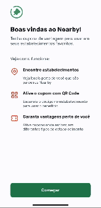

# Nearby

## Sobre o projeto

Nearby é um aplicativo mobile de clube de benefícios que oferece cupons exclusivos para usuários em estabelecimentos próximos. O objetivo do app é permitir que os usuários descubram lojas parceiras e acessem promoções ao escanear QR codes nos locais, aproveitando descontos e vantagens especiais.

## Tecnologias utilizadas

- React Native com Expo: O projeto foi desenvolvido utilizando React Native, aproveitando o poder do Expo para simplificar o processo de desenvolvimento do app.
- Expo Router: Utilizamos o Expo Router para gerenciar a navegação dentro do aplicativo, proporcionando uma experiência fluida e sem complicações.
- Mapas: Integração com mapas para mostrar a localização dos estabelecimentos parceiros em tempo real.

## Como funciona

1. O usuário abre o app e permite o acesso à sua localização.
2. O mapa exibe as lojas parceiras que estão próximas ao usuário.
3. Ao selecionar uma loja, o usuário vê as informações detalhadas sobre o estabelecimento, como endereço e telefone.
4. No local da loja, o usuário pode escanear um QR code para obter um cupom exclusivo, que pode ser utilizado diretamente no estabelecimento.

## Executando o projeto mobile

Certifique-se de ter o yarn instalado em sua máquina. Além disso, é possível abrir o projeto em um emulador ou através do aplicativo [Expo Go](https://expo.dev/client) no dispositivo físico.

1. Clone o repositório.
2. Dentro do diretório `mobile`, instale as dependências com o comando: `yarn`.
3. Dentro do diretório `mobile`, execute o projeto com o comando: `yarn start`.
4. Siga as intruções do terminal para conectar com o emulador ou dispositivo físico.
5. Siga as instruções de integração com a API para que a aplicação mobile funcione corretamente.

## Integração com a API

_Esta API foi disponibilizada e desenvolvida pela Rocketseat para auxiliar no projeto._

Certifique-se de ter o npm instalado em sua máquina.

1. Dentro do diretório `api`, instale as dependências com o comando: `npm install`.
2. Dentro do diretório `api`, execute o projeto com o comando: `npm start`.
3. Dentro do direório `mobile`, na pasta raiz crie um arquivo .env e siga o exemplo do arquivo .env.example para configurar o endereço IP (provavelmente da sua máquina) que a API está rodando.

## Contribuição

Sinta-se à vontade para contribuir com melhorias ou correções neste projeto. Crie um fork do repositório, faça suas alterações e envie um pull request. Estamos abertos a sugestões!

---

**Desenvolvido por Lizandra Malta - github.com/lizandramalta**

_Este projeto foi desenvolvido como parte do desafio proposto pela evento NLW da Rocketseat._
